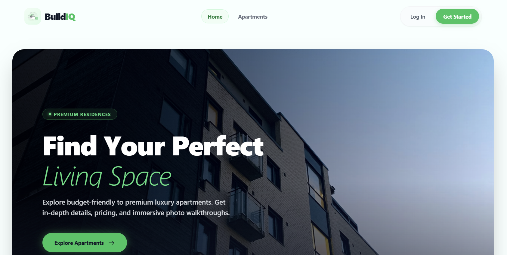
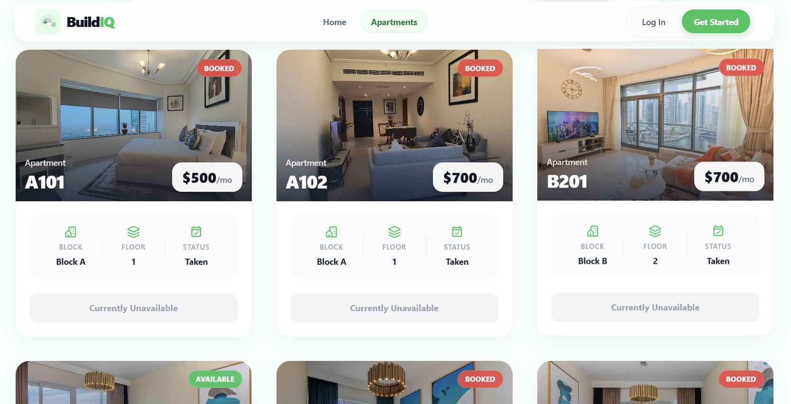

<div align="center">
  

  <br />
  <br />

# 🏢 BuildIQ - Building Management System

**A modern, SaaS-grade platform for seamless apartment hunting, tenant management, and digital rent collection.**

[](https://build-iq.web.app/)
[](https://github.com/maruf-git/buildIQ-server-side)
[](https://react.dev)
[](https://tailwindcss.com)

</div>

<br />

## 📖 Overview

BuildIQ is a premium, full-stack building and apartment management system designed to modernize how property owners, tenants, and prospects interact. Featuring an ultra-modern glassmorphic UI, real-time dashboards, and secure role-based access control, BuildIQ streamlines the entire leasing lifecycle from initial apartment browsing to monthly rent payments.

> The user interface has been extensively designed to mimic top-tier Silicon Valley SaaS products, featuring subtle gradients, staggered animations, interactive hover states, and fully responsive fluid layouts.

## ✨ Core Features

- **🏡 Premium Apartment Discovery**: Cinematic property showcases with smart filtering, price range sliders, and active pagination.
- **🔐 Secure Role-Based Authentication**: Custom dashboards tailored specifically for **Users**, **Members** (Tenants), and **Admins**. Powered by Firebase Auth and JWT.
- **💳 Digital Rent Payments**: Integrated payment gateway simulations allowing members to pay rent securely and track their payment history via interactive tables.
- **📢 Centralized Announcements**: Real-time broadcast system for building-wide updates and alerts from administration.
- **🎟️ Smart Coupon System**: Exclusive discounts and dynamically applied promo codes for rent reductions.
- **📊 Admin Dashboard Operations**: Comprehensive CRM tools to manage users, process incoming agreement requests, declare announcements, drop coupons, and view system statistics.

## 📸 UI/UX Design Showcase

<details open>
  <summary><b>View Extensive Gallery (Click to expand)</b></summary>
  <br />

### Comprehensive Homepage Architecture

  

  <br />
  
  <!-- ### Apartments Listing - Grid & Filtering System
   -->
</details>

## 🚀 Technology Stack & Packages

**Core Technologies:**

- **[ReactJS (Vite)](https://react.dev/)**: Used to construct the complex, single-page application interface. React's component-based architecture guarantees a modular, reactive UI perfectly suited for dashboard applications, while Vite ensures lightning-fast hot-module replacement and rapid build times.
- **JavaScript (ES6+)**: The primary programming language utilized across the entire stack, powering complex state logic, API integrations, and robust DOM manipulations to deliver a seamless user experience.
- **[TailwindCSS](https://tailwindcss.com/)**: Enables ultra-fast UI development through utility-first CSS. It powers the modern, premium glassmorphic visual language, ensuring rapid styling and unparalleled mobile responsiveness without bloated stylesheets.
- **[Axios](https://axios-http.com/)**: Deployed as the primary HTTP client. By leveraging custom Axios interceptors (`useAxiosSecure`), it automatically attaches required JWT authorization headers and effortlessly intercepts unauthorized API requests to seamlessly force re-login flows.

**Supplementary Packages & Architecture:**

- **TanStack Query (React Query)**: Caches asynchronous server data securely, mitigates loading state complexities, and manages auto-refetching.
- **Firebase Authentication**: Handles secure user sign-ups, OAuth integrations, and robust session persistence.
- **Framer Motion**: Drives the beautiful staggered layout animations, route transitions, and micro-interactions.
- **React Hook Form**: Handles complex input validations and rapid client-side form rendering securely.
- **React Router DOM (v6)**: Handles robust client-side routing and protected routes layout nesting.

**Backend Services (External):**

- Node.js, Express.js (REST API)
- MongoDB Serverless (Database)
- Stripe API (Payment Gateway)

## 🛠️ Local Development Setup

Follow these steps to run the client-side environment locally:

### Prerequisites

Make sure you have Node.js (v18+) and npm installed.

### 1. Clone the repository

```bash
git clone https://github.com/maruf-git/buildIQ-client.git
cd buildIQ-client
```

### 2. Install Dependencies

```bash
npm install
```

### 3. Environment Variables

Create a `.env.local` file in the root directory and add your Firebase and API configurations:

```env
VITE_apiKey=your_firebase_api_key
VITE_authDomain=your_firebase_auth_domain
VITE_projectId=your_firebase_project_id
VITE_storageBucket=your_firebase_storage_bucket
VITE_messagingSenderId=your_firebase_messaging_sender_id
VITE_appId=your_firebase_app_id
VITE_API_URL=http://localhost:5000 # Or your live server URL
```

### 4. Start the Development Server

```bash
npm run dev
```

The application will be accessible at `http://localhost:5173`.

## 🤝 Contributing

Contributions, issues, and feature requests are welcome! Feel free to check the [issues page](https://github.com/maruf-git/buildIQ-client/issues).

---

<div align="center">
  <p>Built by <b>Maruf</b></p>
</div>
